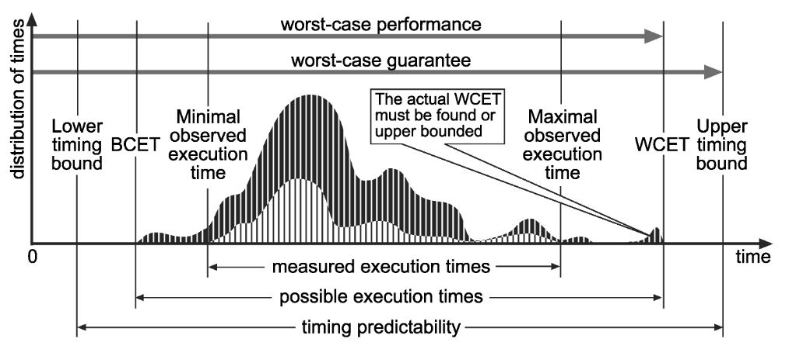
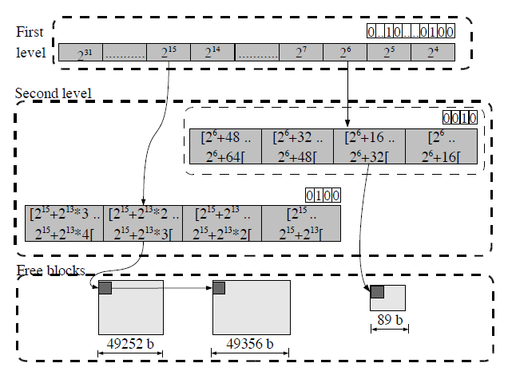

# Motivation of calculating WCET for Real-Time Systems
* Main characteristic of a Real-Time System --> **Guaranteed response times**
* WCET is a metric commonly used in reliable real-time systems which have strict deadlines
	* WCET for ***quaranteed*** response times!

### Some Terminology
* Execution time : The time spent by the job actively using processor resources is its execution time.
* WCET : The maximum length of time a task takes to execute on a specific hardware platform.

# WCET-BCET

# How to measure WCET?
* There is no direct transformation from time complexity to execution time. 
	* Hitting space barriers may cause in much more worse execution time than expected
	* Hardware platform and its configurations mostly differs
	* Compiler differences (Same source code --> Different assembly output in different compilers)
	* And many more..
* Execution time depends on many conditions : Inputs, cache content, state of pipeline etc.
* The problem of finding a program's worst-case execution time is in general ***undecidable and is equivalent to halting problem***. However, researchers suggested some conditions for this problem to be decidable. These conditions are bounded loops, absence of recursive function calls, and absence of dynamic function calls(2). These conditions generally make it possible to calculate an upper bound for WCET for Real-time systems since they only use a restricted form of programming, which guarantees that programs always terminate; recursion is not allowed or explicitly bounded as are the iteration counts of loops. 
* Many suggested methods assume a simple hardware structure where cache analysis is neglected. Presence of caches makes the analysis complicated. 
* On the other hand, some analysis methods for WCET calculation suggest different strategies to consider the cache structure (graph coloring, path enumeration etc.). However, these methods are based on exhaustive testing on synthetic and natural workloads and can only overestimate WCET for a program.  

--------------------------------------------------------------------------

# Dynamic Memory Allocation 
* Main characteristic of a Real-Time System --> **Guaranteed response times**
* WCET : The maximum length of time a task takes to execute on a specific hardware platform
* WCET is a metric commonly used in reliable real-time systems which have strict deadlines
	* WCET for ***quaranteed*** response times!

### Dynamic Memory
* Dynamic memory management is normally avoided by real-time systems because WCET of dynamic memory allocation routines are not bounded or are bounded with an excessively large bound.
* Observe each allocator's worst-case behavior by executing real and synthetic workloads. The results is a guideline for developers of real-time systems(Using dynamic memory management/ algorithm to use for dynamic allocation)

* “Developers of real-time systems avoid the use of
dynamic memory management because they fear that the
worst-case execution time of dynamic memory allocation
routines is not bounded or is bounded with a too important
bound”(1)

# Measuring the Performance of a Dynamic Memory Allocator
* We must measure the efficiency of our free space. The free list must be analyzed during the simulation and the biggest free block value in the free list is recorded. At the end of the testing, the smallest value among the biggest free blocks is recorded. That gives us the values above which allocation may fail due to external fragmentation. By exhaustive testing, an average worst case can be calculated. 
* Another metric to be used can be to measure the average size of free blocks in the simulation. The metric is compared with the average value of the  largest  request  during  the  simulation. An indication of a potential problem is shown when the average is below the amount of the largest block requested since, in those cases, the request may not be satisfied.
* Altough external fragmentation is the main problem with dynamic allocation, increasing the block sizes to avoid it increases the internal fragmentation. So, a balance must be found for each system. 
* Performance metric: The performance speed of the different dynamic memory management systems, the metric for performance speed is measured as the number of scans needed to access the memory blocks.

* The performance speed metrics have been used for memory allocations and  deallocations to  measure the average and the worst case value. The worst case value is important considering we are investigating **real-time  systems**.  In the allocation scenario, all the scans needed to allocate  the request are included, which include the number of scans needed to insert a remaining free chunk in the free list in case the free block is split.

# Dynamic Memory Allocation in Real-Time Systems

### 3 CONS
1. Allocation call (malloc()) is non-deterministic --> Predictibility of performance is a key requirement in Real-time Systems
2. Allocation request may fail in an unpredictable manner (Because of heap fragmentation)
3. Inefficient memory utilization (External Fragmentation)

# Requirements of real-time systems regarding dynamic memory
1. Bounded response time: WCET of memory allocation and deallocation must be known.
2. Fast response time: An algorithm being bounded is not enough. It must also be fast enough to be used. 
3. Memory requests must **never** fail: In order to achieve this, the DSA must be designed efficiently enough for fragmentation.

# Ways of Dynamic Allocation in Real-time Systems
* As standard malloc implementations suffer from fragmentation because of variable block sizes, it is not recommendable to use them in a real time system due to performance. A more efficient solution is preallocating a number of memory blocks with the same size called the memory pool.(3)
* Memory management facilities that are compatible with real time requirements – i.e. they are deterministic – are usually provided. This is most commonly a scheme which allocates blocks – or “partitions” – of memory under the control of the OS.

### Partition Pool 
* Block memory allocation is performed using a “partition pool”, which is defined statically or dynamically and configured to contain a specified number of blocks of a specified fixed size. (4)
	* PROS: Allocation/deallocation time is guaranteed to be O(1) in any reasonable implementation, does not suffer from fragmentation, easier to plan its size in advance, failure to allocate at run-time is (likely) easier to mitigate
	* CONS: Works for a single specific object size - memory is not shared between other parts of the program, requires a planning for the right size of the pool or risking potential waste of memory

# TLSF: A new dynamic memory allocator for real-time systems
* A new algorithm, called TLSF, for dynamic memory allocation that presents a bounded worst-case response time, while keeping the efficiency of the allocation and deallocation operations with a temporal cost of O(1). In addition, the fragmentation problem has higher impact in system performance with long time running applications. A small and bounded fragmentation is also achieved by the proposed algorithm.

## Design principals
1. Immediate coalescing: As soon as a block is freed, the algorithm is designed to merge the freed block with adjacent free blocks ,if any, to build up larger free block. 
2. Splitting threshold: The smallest block of allocatable memory is 16 bytes. By this limit, it is possible to store the information needed to manage them, including the list of free blocks pointers. This approach optimises the memory usage.
3. Good-fit strategy: TLSF uses a large set of free lists where each list is a non-ordered list of free blocks whose size is between the size class and the new size class. Each segregated list contains blocks of the same class. 
4. Same strategy for all block sizes: Some DSA algorithms use different allocation strategies for different request sizes. TLSF uses the same strategy for all sizes which provide uniform behaviour, thus predictable WCET/
5. Memory is not cleaned-up: In multi-user environments, DSA algorithms have to clean the memory by usually filling with zeros in order to avoid security problems. In TLSF, since we assume the algorithm will be used in a trusted environment, the algorithm does not clean up the memory when allocating which would bring considerable overhead.

## TLSF Data Structure
* Segregated fit mechanism. 
* Array of free blocks within a size class
* Two-level structure to speedup access and reduce fragmentation.
* First level: Divides free blocks in classes of power of 2
* Second level: Divides the size range indicated by the first level by 4. Example: 2^6 first level covers the range of free list blocks of [2^6,2^7) --> This range is divided into 4 equidistant blocks.
* Bitmap for each level. 1 indicates the presence of free blocks under the level.

## Finding a free block in TLSF malloc()
* TLSF searches for a free block for a request in the order:
1. First level index and second level index corresponding to the request is calculated. The indices are checked if a free block is available. If a free block is available at the indices, the block is returned. 
2. If a free block is not available at the indices, remaining second level indices are searched to find a free block. If a free block is available, it is returned.
3. If not found, the next first level index whose value is 1 in the bitmap is searched to find a free block which guarantees to find a free block. 

### Worst case happens when
1. The first level index calculated for the requested size is 1 and second level indices are examined which results in a fail to find a free block = or > the requested size. 
2. The next free block available is on the right-most free-blocks list of the second level of the left-most first level index. When a small block is requested with size x, x bytes will be extracted from this huge block and returned. The remaining huge block going to the lower first level index results in the most overhead for this allocation operation.

## Freeing a block in TLSF free()
1. When a block is freed, the first thing done is to check if the physical neighbour blocks are free or not.
2. If either of the neighbours are free, it is merged with the newly freed block. After the merge, new big block is inserted in the appropriate segregated list. (Mapping function is used to find first level and second level indices of the block)
3. If neither of the neighbours are free, only the freed block is put on to the appropriate place in the segregated list.

#### Main Resources
* https://github.com/mattconte/tlsf
* https://www.embedded.com/improving-performance-for-dynamic-memory-allocation-2/
* https://www.thinkmind.org/articles/computation_tools_2012_1_10_80006.pdf
* http://www.christiandelrosso.org/22-icsea.pdf
* https://upcoder.com/15/measure-memory-allocation-cost-by-eliminating-it
* For WCET --> https://www.sciencedirect.com/topics/computer-science/worst-case-execution-time

##### References
1) I. Puaut. Real-Time Performance of Dynamic Memory
Allocation Algorithms. 14 th Euromicro Conference
on Real-Time Systems, page 41, 2002.
2) https://www.sciencedirect.com/topics/computer-science/worst-case-execution-time
3) https://en.wikipedia.org/wiki/Memory_pool
4) https://www.thinkmind.org/articles/computation_tools_2012_1_10_80006.pdf
